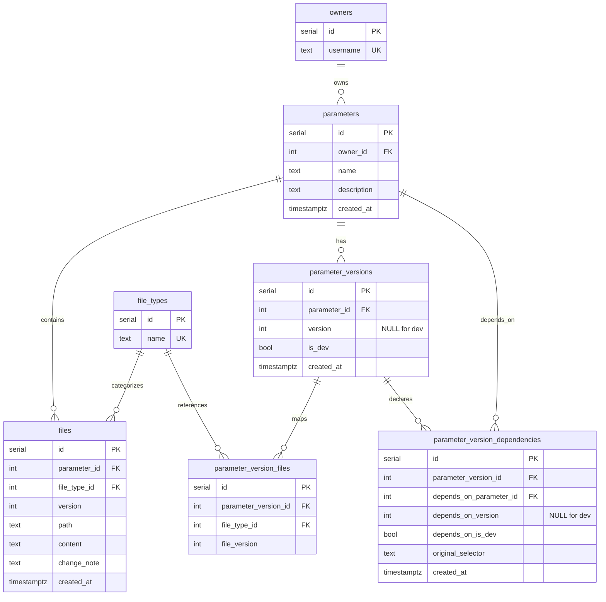
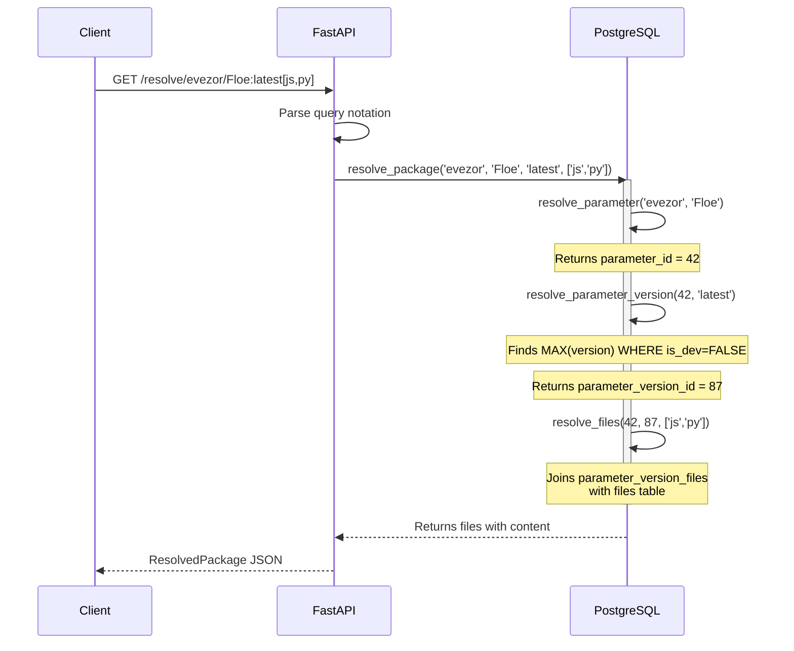
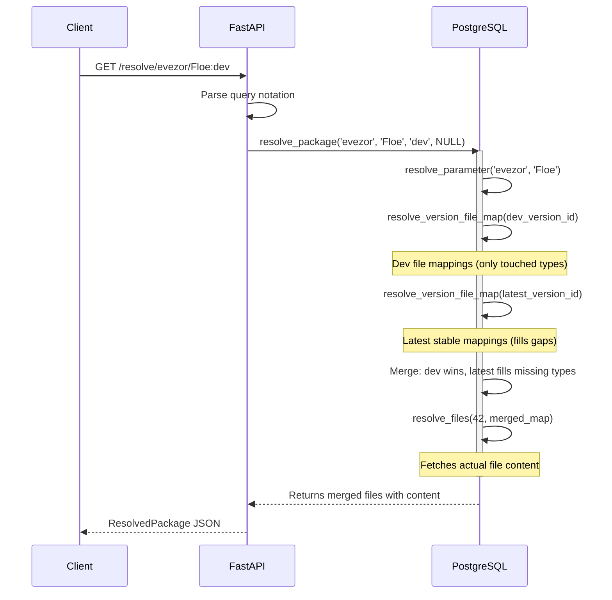
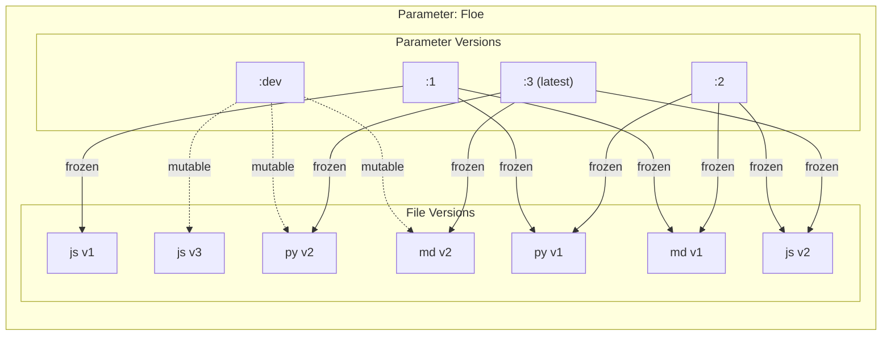
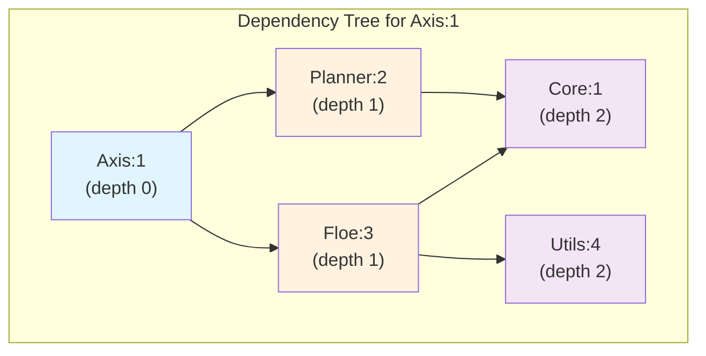
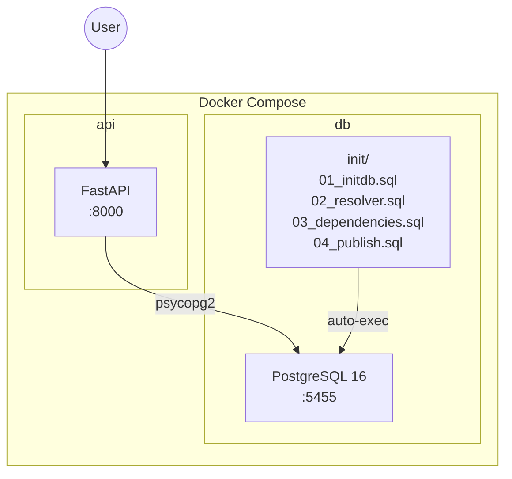
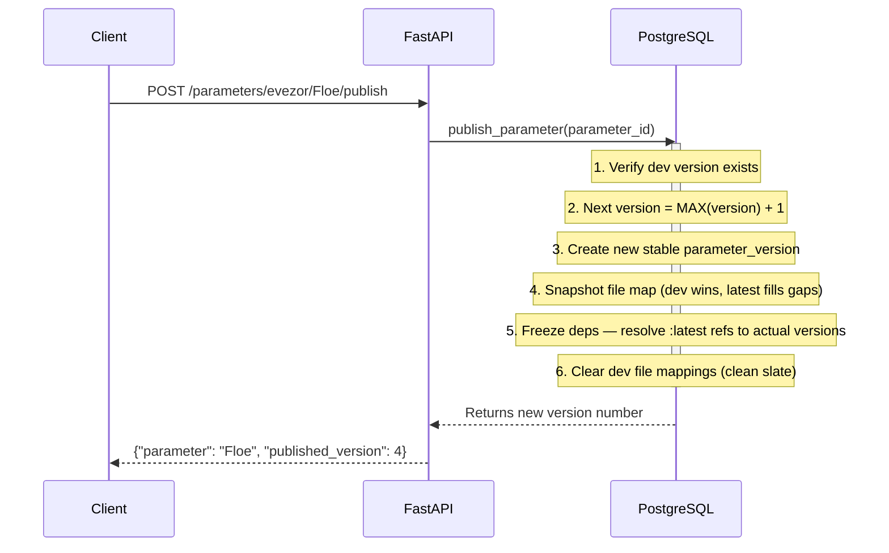
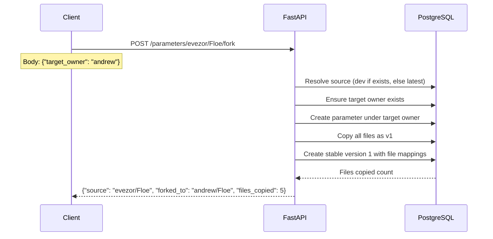

# Parameter Registry - System Architecture

## Database Entity-Relationship Diagram

## API Endpoints Overview

```mermaid
flowchart TB
    subgraph Client
        REQ[HTTP Request]
    end

    subgraph "FastAPI Server :8000"
        subgraph "Health & Meta"
            ROOT["GET /"]
            HEALTH["GET /health"]
            STATS["GET /stats"]
            FTYPES["GET /file-types"]
            LOAD["POST /load"]
            REPLAY["POST /replay"]
        end

        subgraph "Owner Endpoints"
            OWNERS["GET /owners"]
            OWNER["GET /owners/{username}"]
            OWNER_CREATE["POST /owners"]
        end

        subgraph "Parameter Endpoints"
            PARAMS["GET /parameters"]
            PARAM["GET /parameters/{owner}/{name}"]
        end

        subgraph "Mutation Endpoints"
            FILEVERS["POST /.../file-versions"]
            PUBLISH["POST /.../publish"]
            FORK["POST /.../fork"]
        end

        subgraph "Resolution Endpoints"
            RESOLVE["GET /resolve/{query}"]
            DEPS["GET /dependencies/{owner}/{name}"]
        end
    end

    subgraph "PostgreSQL :5455"
        DB[(Database)]
        subgraph "Resolver Functions"
            F1["resolve_parameter()"]
            F2["resolve_parameter_version()"]
            F2b["resolve_version_file_map()"]
            F3["resolve_files()"]
            F4["resolve_package()"]
            F5["resolve_dependency_tree()"]
            F6["resolve_dependencies()"]
        end
        subgraph "Write Functions"
            P1["publish_parameter()"]
        end
        subgraph "Triggers"
            T1["check_cyclic_dependency()"]
            T2["prevent_file_delete_if_used()"]
        end
    end

    REQ --> ROOT & HEALTH & STATS & FTYPES & LOAD & REPLAY
    REQ --> OWNERS & OWNER & OWNER_CREATE
    REQ --> PARAMS & PARAM
    REQ --> FILEVERS & PUBLISH & FORK
    REQ --> RESOLVE & DEPS

    ROOT & HEALTH & STATS & FTYPES & LOAD & REPLAY --> DB
    OWNERS & OWNER & OWNER_CREATE --> DB
    PARAMS & PARAM --> DB
    FILEVERS --> DB
    PUBLISH --> P1
    FORK --> DB
    RESOLVE --> F4
    DEPS --> F5
    F4 --> F1 --> F2 --> F3
    F5 --> F1 --> F6
    P1 --> DB
    F1 & F2 & F2b & F3 & F4 & F5 & F6 --> DB
    T1 & T2 --> DB
```

## Package Resolution Flow

### Stable / Specific Version

### Dev (merged) Resolution

When the selector is `:dev`, `resolve_package` merges the dev file map over the latest stable version. Dev mappings win; any file types not touched in dev fall back to the latest stable version's mappings.

## Versioning Model

## Dependency Resolution

## Docker Architecture

## Query Notation Reference

| Format | Example | Description |
|--------|---------|-------------|
| `owner/param:latest` | `evezor/Floe:latest` | Latest stable version |
| `owner/param:dev` | `evezor/Floe:dev` | Development version |
| `owner/param:N` | `evezor/Floe:2` | Specific version |
| `owner/param:selector[types]` | `evezor/Floe:latest[js,py]` | Filter file types |

## Publish Flow

Publishing snapshots the current dev state as a new numbered stable version, then resets dev to a clean slate.

## Fork Flow

Forking copies a parameter (dev state if available, otherwise latest stable) into a new owner's namespace as version 1.

## Endpoint Reference

| Method | Path | Purpose |
|--------|------|---------|
| GET | `/` | Serves interactive HTML UI |
| GET | `/health` | Health check |
| GET | `/stats` | Counts: owners, parameters, versions, files, dependencies |
| GET | `/file-types` | List registered file types |
| POST | `/load` | Load parameters from `/app/Parameters` folder |
| POST | `/replay` | Replay all recorded mutations from `replay.json` |
| GET | `/owners` | List all owners |
| GET | `/owners/{username}` | Get single owner |
| POST | `/owners` | Create owner |
| GET | `/parameters?owner={owner}` | List parameters (optional owner filter) |
| GET | `/parameters/{owner}/{name}` | Full parameter detail with all versions |
| POST | `/parameters/{owner}/{name}/file-versions` | Create new file versions, update dev mapping |
| POST | `/parameters/{owner}/{name}/publish` | Publish dev → new stable version |
| POST | `/parameters/{owner}/{name}/fork` | Fork parameter to another owner |
| GET | `/resolve/{query}` | Resolve package query → files with content |
| GET | `/dependencies/{owner}/{name}?selector=` | Full recursive dependency tree |
