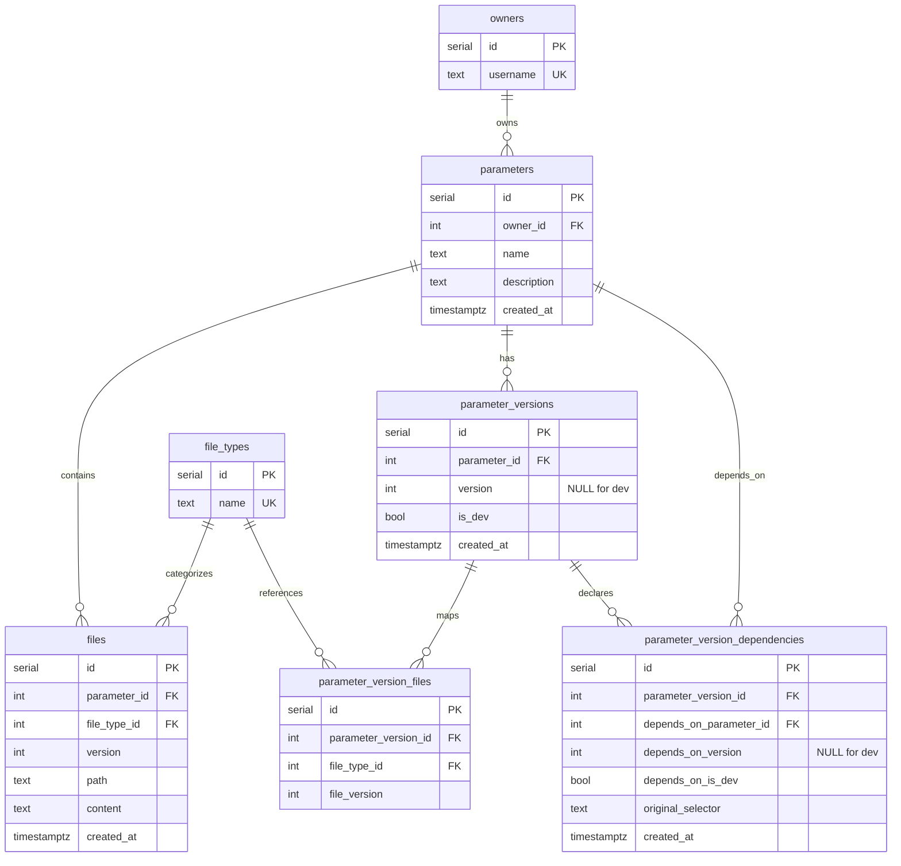
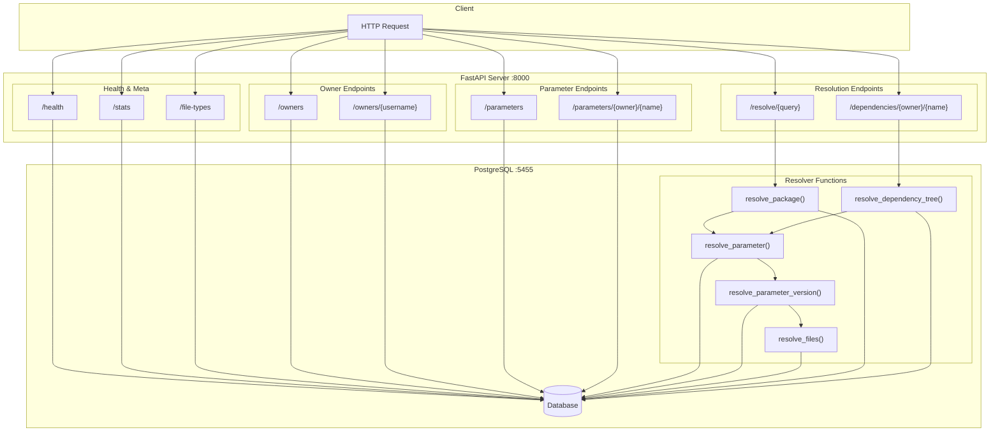
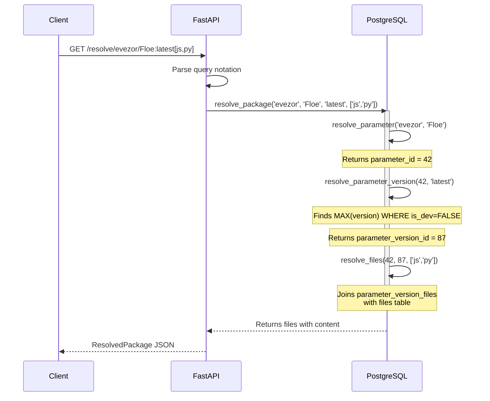
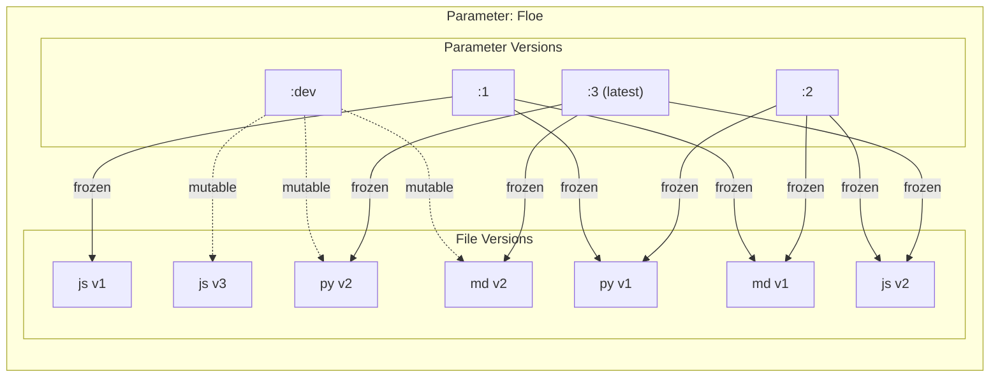
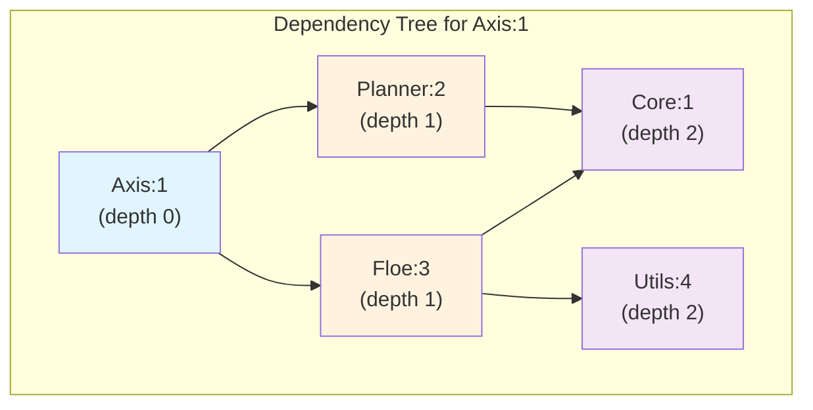
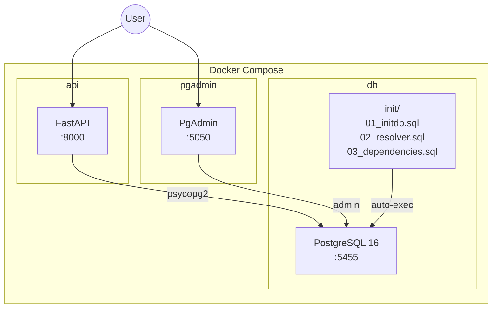

# Parameter Registry - System Architecture

## Database Entity-Relationship Diagram

## API Endpoints Overview

## Package Resolution Flow

## Versioning Model

## Dependency Resolution

## Docker Architecture

## Query Notation Reference

| Format | Example | Description |
|--------|---------|-------------|
| `owner/param:latest` | `evezor/Floe:latest` | Latest stable version |
| `owner/param:dev` | `evezor/Floe:dev` | Development version |
| `owner/param:N` | `evezor/Floe:2` | Specific version |
| `owner/param:selector[types]` | `evezor/Floe:latest[js,py]` | Filter file types |
